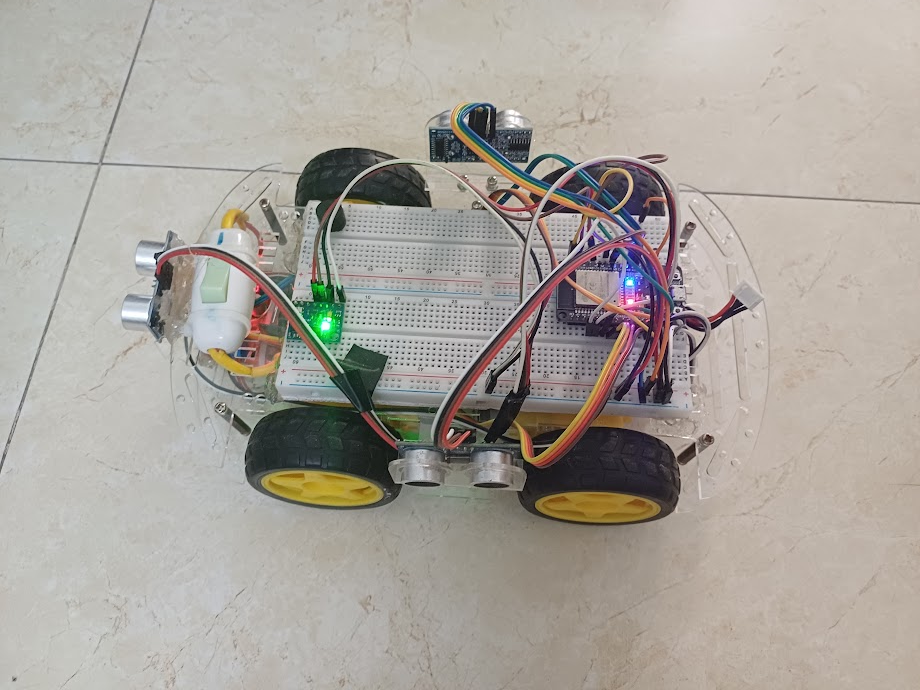
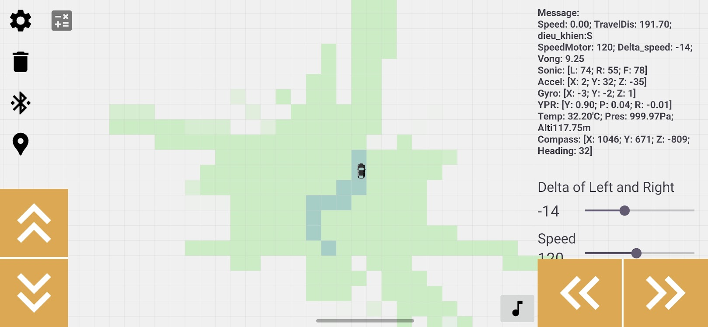

# HỆ THỐNG ĐIỀU KHIỂN Ô TÔ RÀ SOÁT BỀ MẶT QUẢN LÝ KHU VỰC

## Thành viên
| Họ và tên       | Mã sinh viên | Nhiệm vụ                                            |
| --------------- | ------------ | --------------------------------------------------- |
| Trần Việt Dũng  | B21DCCN036   | Code logic Arduino, lắp rắp xe                      |
| Nguyễn Trần Đạt | B21DCCN216   | App android VaxRobot, lắp rắp xe                    |
| Trần Đức Lộc    | B21DCCN492   | Liên kết, logic điều khiển bluetooth xe, lắp rắp xe |

## Chức năng chính của xe

- Có khả năng nhận tín hiệu blutooth kết nối và nhận lệnh từ điện thoại trong phạm vi của kết nối bluetooth (~10 m)
- Điều khiển thủ công tiến, lùi, quay trái, phải
- Nhận các thông tin từ cảm biến như la bàn, con quay hồi chuyển, encoder để tính toán ra các giá trị như quãng đường đã di chuyển, hướng di chuyển hiện tạo để kết hợp và hiển thị lên bản đồ
- Nhận thông tin từ cảm biến siêu âm để đo khoảng cách tương đối của xe đến vật thể. Từ đó vẽ lên bản đồ địa hình.

## Hướng phát triển

### Về mục tiêu

- Mức 0,5: Vẽ bản đồ và điều khiển thủ công (Mức hiện tại)
- Mức 1,0: Tự động dò đường và vẽ bản đồ
- Mức 2,0: Tự giải bài toán tìm đường khi biết bản đồ địa hình, điểm xuất phát và điểm đích.

### Về thiết kế và cảm biến

- Sử dụng cảm biến siêu âm để đo khoảng cách (Mức hiện tại):
  - Còn nhiều nhược điểm và sai số do giới hạn của cảm biến
- Dự kiến chuyển sang cảm biến li-da sủ dụng laze để nhận thông tin chính xác hơn.

- Nâng cấp sử dụng cảm biến encoder với độ chính xác cao hơn.
- Sử dụng khung nhôm định hình (nếu cần)

### Về lập trình

- Xử lý sự trôi của con quay hồi chuyển dựa vào la bàn để đạt được giá trị hướng tối ưu.
- Xử lí logic dò đường và di chuyển của xe
- ...

## Sản phẩm hiện tại

### Xe

### Giao diện phần mềm

### Phần mềm (file code)

1. [Code Arduino](Dieu_Khien_Blutooth/Dieu_Khien_Blutooth.ino)
2. [Android app](VaxRobot)